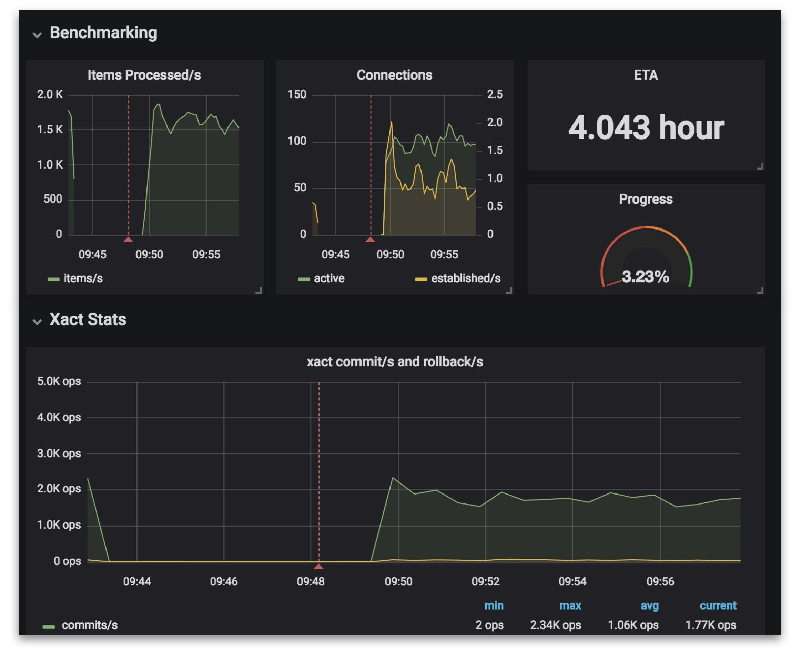

# pgreplay-go [](https://github.com/danicaceres1998/pgreplay-go/actions?query=branch%3Amaster)

> See a discussion of building this tool at https://blog.lawrencejones.dev/building-a-postgresql-load-tester/

This tool is a different take on the existing [pgreplay](
https://github.com/laurenz/pgreplay) project. Where pgreplay will playback
Postgres log files while respecting relative chronological order, pgreplay-go
plays back statements at approximately the same rate they were originally sent
to the database.

When benchmarking database performance, it is better for a replay tool to
continue sending traffic than to halt execution until a strangling query has
complete. If your new cluster isn't performing, users won't politely wait for
your service to catch-up before issuing new commands.

## Benchmark strategy

You have an existing cluster and want to trial new hardware/validate
configuration changes/move infrastructure providers. Your production services
depend on ensuring the new change is safe and doesn't degrade performance.

### 1. Configure production logging

First capture the logs from your running Postgres instance. You may need to add
additional storage to your machine before starting- we often attach a new disk
and change our log location to that disk for experiments.

You can turn on logging in a compatible format like so:

```sql
ALTER SYSTEM SET log_directory='/postgres-logs';
ALTER SYSTEM SET log_connections='on';
ALTER SYSTEM SET log_disconnections='on';
ALTER SYSTEM SET log_line_prefix='%m|%u|%d|%c|';
ALTER SYSTEM SET log_min_error_statement='log';
ALTER SYSTEM SET log_min_messages='error';
ALTER SYSTEM SET log_statement='all';
ALTER SYSTEM SET log_min_duration_statement=0; 
SELECT pg_reload_conf();
```

Or, if you need to capture logs for an RDS instance, you can use these parameters in your
instances parameter group:

```
log_destination = csvlog
log_connections = 1
log_disconnections = 1
log_min_error_statement = log
log_min_messages = error
log_statement = all
log_min_duration_statement = 0
```

### 2. Take snapshot

Now we're emitting logs we need to snapshot the database so that we can later
restore it to the same moment in time on our benchmark clusters. If you're
running in a cloud provider with disk snapshot facilities then this is likely
the easiest of options (remember to checkpoint first, to reduce recovery time)
but you can also achieve this using `pg_basebackup` and point-in-time recovery
configuration, or by taking a physical copy of a paused replica.

Whatever method used must produce an image that can be restored into new
machines later.

### 3. Extract and process logs

Once you've captured logs for your desired benchmark window, you can optionally
pre-process them to create a more realistic sample. Complex database
interactions are likely to have transactions that may fail when we play them
back out-of-order. Recalling that our primary goal is to create representative
load on the database, not a totally faithful replay, we suggest applying the
following filters:

```
$ cat postgresql.log \
| pv --progress --rate --size "$(du postgresql.log | cut -f1)" \
| grep -v "LOG:  statement: BEGIN" \
| grep -v "LOG:  statement: COMMIT" \
| grep -v "LOG:  statement: ROLLBACK TO SAVEPOINT" \
| grep -v "LOG:  statement: SAVEPOINT" \
| grep -v "LOG:  statement: RELEASE SAVEPOINT" \
| grep -v "LOG:  statement: SET LOCAL" \
| sed 's/pg_try_advisory_lock/bool/g' \
| sed 's/pg_advisory_unlock/pg_advisory_unlock_shared/g' \
> postgresql-filtered.log
```

By removing transactions we avoid skipping work if any of the transaction
queries were to fail - the same goes for savepoints.
We remove any `SET LOCAL` statements, as having removed transactions these
configuration settings would be present for the duration of the connection.
We then modify any advisory lock queries to be shared, preventing us from
needlessly blocking while still requiring the database to perform similar levels
of work as the exclusive locking.

These transformations mean our replayed queries won't exactly simulate what we
saw in production, but that's why we'll compare the performance of these
filtered logs against the two clusters rather than the original performance of
the production cluster.

### 4. pgreplay-go against copy of production cluster

Now create a copy of the original production cluster using the snapshot from
(2). The aim is to have a cluster that exactly replicates production, providing
a reliable control for our experiment. 

The goal of this run will be to output Postgres logs that can be parsed by
[pgBadger](https://github.com/darold/pgbadger) to provide an analysis of the
benchmark run. See the pgBadger readme for details, or apply the following
configuration for defaults that will work:

```sql
ALTER SYSTEM SET log_min_duration_statement = 0;
ALTER SYSTEM SET log_line_prefix = '%t [%p]: [%l-1] user=%u,db=%d,app=%a,client=%h '
ALTER SYSTEM SET log_checkpoints = on;
ALTER SYSTEM SET log_connections = on;
ALTER SYSTEM SET log_disconnections = on;
ALTER SYSTEM SET log_lock_waits = on;
ALTER SYSTEM SET log_temp_files = 0;
ALTER SYSTEM SET log_autovacuum_min_duration = 0;
ALTER SYSTEM SET log_error_verbosity = default;
SELECT pg_reload_conf();
```

Run the benchmark using the pgreplay-go binary from the primary Postgres machine
under test. pgreplay-go requires minimal system resource and is unlikely to
affect the benchmark when running on the same machine, though you can run it
from an alternative location if this is a concern. An example run would look
like this:

```
$ pgreplay \
    --errlog-file /data/postgresql-filtered.log \
    --host 127.0.0.1 \
    --metrics-address 0.0.0.0 \
    --start <benchmark-start-time> \
    --finish <benchmark-finish-time>
```

If you run Prometheus then pgreplay-go exposes a metrics that can be used to
report progress on the benchmark. See [Observability](#observability) for more
details.

Once the benchmark is complete, store the logs somewhere for safekeeping. We
usually upload the logs to Google cloud storage, though you should use whatever
service you are most familiar with.

### 5. pgreplay-go against new cluster

After provisioning your new candidate cluster, with the hardware/software
changes you wish to test, we repeat step (4) for our new cluster. You should use
exactly the same pgreplay logs and run the benchmark for the same time-window.

As in step (4), upload your logs in preparation for the next step.

### 6. User pgBadger to compare performance

We use pgBadger to perform analysis of our performance during the benchmark,
along with taking measurements from the
[node_exporter](https://github.com/prometheus/node_exporter) and
[postgres_exporter](https://github.com/rnaveiras/postgres_exporter) running
during the experiment.

pgBadger reports can be used to calculate a query duration histogram for both
clusters - these can indicate general speed-up/degradation. Digging into
specific queries and the worst performers can provide more insight into which
type of queries have degraded, and explaining those query plans on your clusters
can help indicate what might have caused the change.

This is the least prescriptive part of our experiment, and answering whether the
performance changes are acceptable - and what they may be - will depend on your
knowledge of the applications using your database. We've found pgBadger to
provide sufficient detail for us to be confident in answering this question, and
hope you do too.

## Observability

Running benchmarks can be a long process. pgreplay-go provides Prometheus
metrics that can help determine how far through the benchmark has progressed,
along with estimating how long remains.

Hooking these metrics into a Grafana dashboard can give the following output:



We'd suggest that you integrate these panels into your own dashboard; for
example by showing them alongside key PostgreSQL metrics such as transaction
commits, active backends and buffer cache hit ratio, as well as node-level
metrics to show CPU and IO saturation.

A sample dashboard with the `pgreplay-go`-specific panels has been provided that
may help you get started. Import it into your Grafana dashboard by downloading
the [dashboard JSON file](res/grafana-dashboard-pgreplay-go.json).

## Types of Log

### Simple

This is a basic query that is executed directly against Postgres with no
other steps.

```
2010-12-31 10:59:52.243 UTC|postgres|postgres|4d1db7a8.4227|LOG:  statement: set client_encoding to 'LATIN9'
```

### Prepared statement

```
2010-12-31 10:59:57.870 UTC|postgres|postgres|4d1db7a8.4227|LOG:  execute einf"ug: INSERT INTO runtest (id, c, t, b) VALUES ($1, $2, $3, $4)
2010-12-31 10:59:57.870 UTC|postgres|postgres|4d1db7a8.4227|DETAIL:  parameters: $1 = '6', $2 = 'mit    Tabulator', $3 = '2050-03-31 22:00:00+00', $4 = NULL
```
